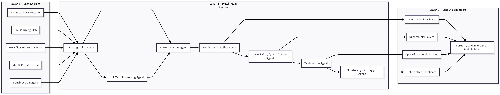

## Text-Augmented Windthrow Nowcasting with a Multi-Agent Automation Framework

### University of Oulu - Centre for Machine Vision & Signal Processing (CMVS)

## Project Description

This project develops a multi-agent, text-augmented nowcasting framework for predicting storm-induced windthrow risk in Finnish forests at a 1 km resolution.
The system fuses numerical weather forecasts, forest structural attributes, terrain variables, and semantically enriched warning texts extracted from official Finnish CAP weather bulletins.

A coordinated set of agents, covering data ingestion, NLP-based text interpretation, feature fusion, probabilistic modeling, uncertainty quantification, and explanation generation, enables an automated, near-real-time operational pipeline.
The framework focuses on both nowcasting (0–24 h) and short-term forecasting (1–7 days) to support proactive forest management, power grid protection, and emergency preparedness.

The framework outputs:

- Grid-level windthrow probabilities
- Optional damage severity classes
- Uncertainty surfaces
- NLP generated practitioner oriented explanations, forming the core of a reproducible and operational early-warning workflow for Finland.

## Project Goal

1. Continuously monitors
- FMI weather forecasts and nowcasts
- FMI CAP warning texts (XML) 
- Forest structural data
- Topography and remote sensing inputs

2. Extracts and fuses
- Meterological drivers of windthrow
- Forest susceptibility indicators
- Terrain exposure metrics
- Textual signals such as "treefall risk", "dangerous winds", or "power outage risk"

3. Predicts
- Windthrow probability at 1 km resolution
- Severity tiers (light/moderate/severe), when data allow

4. Quantifies uncertainty
- Using calibrated probabilistic modeling and spatial smoothing

5. Generates explanations
- Using an LLM-based agent that converts SHAP values + warning semantics into concise, context-aware narratives for forestry and emergency agencies.

All in all, the project builds an operational prototype of a Finnish forest storm-risk early-warning engine using agentic AI and multi-modal data fusion. 

## Research Questions

- RQ1: Does adding CAP warning text (via NLP embeddings) improve grid-level windthrow prediction beyond numeric weather and forest features?
- RQ2: Can an NLP agent extract impact-related cues (e.g., treefall, outages) from warnings that meaningfully correlate with observed windthrow?
- RQ3: Can a multi-agent system fully automate data ingestion, feature fusion, modeling, uncertainty estimation, and updates in near real time?
- RQ4: Can an LLM explanation agent generate concise, useful explanations of model outputs for operational forestry and emergency users?

## Overview

This repository contains the full implementation of a multi-agent, text-augmented nowcasting system for predicting storm-induced windthrow risk in Finnish forests at a 1 km resolution. The system integrates:

- Numerical weather forecasts (FMI) 
- Forest structural data (Metsäkeskus)
- Terrain/topography
- CAP weather warning texts (XML)
- Remote sensing-based and EMS ground-truth damage labels

A multi-agent system (MAS) architecture orchestrates automated:

- Data ingestion
- Text processing
- Feature fusion
- Probabilistic modeling
- Uncertainty quantification
- Explainable AI summaries
- Near-real-time monitoring and inference

This project supports a reproducible research pipeline and operational early-warning experiments for Finnish forestry, emergency management, and energy resilience.

## Data sources

All data sources used are openly available:

- FMI Open Data API - forecasts, observations
- FMI CAP XML Warnings - textual severe weather bulletins
- Metsäkeskus Open Forest Data - forest stand features
- NLS DEM 10m - terrain data
- Sentinel-2 - pre/post-strom NDVI/NDMI
- Copernicus EMS - storm damage ground truth
- LUKE - regional storm damage assessments

## Multi-Agent System (MAS) Architecture Diagram

